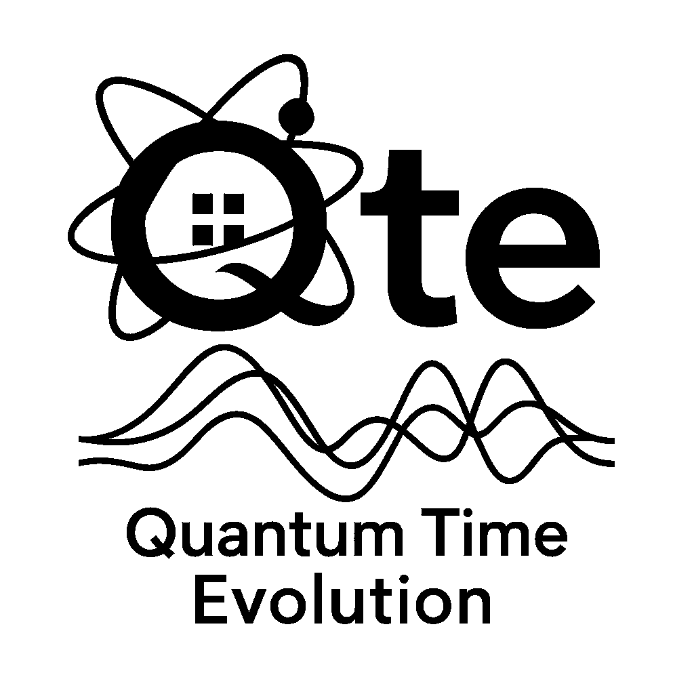

# Qte (QuantumTimeEvolution)

Qte is a set of Max/MSP externals for building finite-dimensional quantum systems and computing their time development from a given Hamiltonian.

This repository contains:
- Source code for the externals (`source/`)
- Max help patches (`help/`)
- Max help patches (`external/`)

ATTENTION: The externals will only work on Mac OS.

In order to install it, copy the "qte" folder inside the "packages" folder in your Max folder. The Max packages folder is under "Documents/Max 8" (for Max 8) or "Documents/Max 9" (for Max 9).

If you installed qte "by hand" on a Mac, chances are that you'll have to remove the quarantine manually as well. The simplest way to do it is by going in the terminal and typing

xattr -rd com.apple.quarantine ~/Documents/Max\ 8/Packages/qte/* 
or substitute the folder where the package is in, if it's a different one. 

Apache-2.0. See `LICENSE`.
